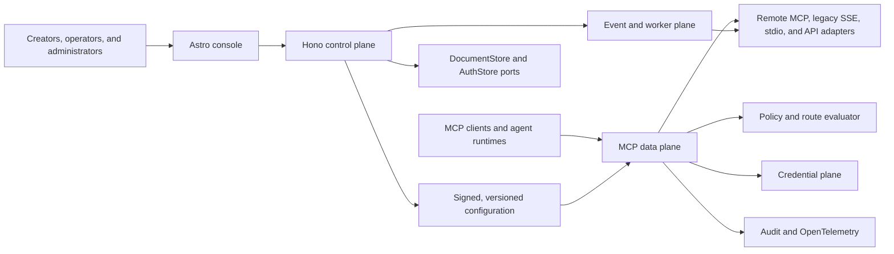

# LiteMCP Composer architecture

Status: implemented vertical-slice baseline with explicitly tracked gaps. See
[`IMPLEMENTATION_STATUS.md`](./IMPLEMENTATION_STATUS.md).

## Purpose

LiteMCP Composer is an open-source, MCP-native enterprise composition control
plane. MCP composition is its primary domain—not a compatibility surface added
to an LLM gateway or general workflow product. It gives an organization one
stable MCP entry point while retaining the identity, origin, schema, version,
credential, policy, and route context of every upstream capability.
The managed cloud deployment, currently hosted on Cloudflare, and the portable
Node.js deployment used by Docker and Kubernetes share the same domain and
protocol runtime. Hosting adapters differ; product semantics must not.

The architecture optimizes for:

- discovery and execution governed by the same policy decision model;
- per-user and shared connected accounts without exposing reusable secrets;
- deterministic routing, explainable decisions, and safe failover;
- a free managed cloud and a complete, no-call-home self-hosted distribution;
- open configuration and tested cloud-to-on-premises portability;
- a modular first production system rather than unnecessary microservices.

## Non-negotiable boundaries

1. All product capabilities, including RBAC, policy, SSO, SCIM, audit, HA
   configuration, backup/restore, and security fixes, remain in the public
   Apache-2.0 source tree.
2. The cloud service does not mint authority required by a self-hosted
   installation. Self-hosted operation has no mandatory external dependency.
3. Cloudflare APIs appear only in the `apps/managed-cloud` composition root and
   `packages/adapter-cloudflare`. Domain, MCP, policy, auth contracts, and SDKs
   use Web-standard interfaces.
4. Better Auth establishes application identity and sessions. It is not the
   authorization boundary. The Hono API and MCP gateway enforce authorization
   independently.
5. Tool payloads are not retained by default. Secrets never enter ordinary
   logs, traces, URLs, MCP descriptors, or client-visible errors.
6. An upstream capability is never flattened so far that its origin, version,
   schema, risk class, or policy identity is lost.

## System context



## Logical planes

| Plane | Responsibilities | Security boundary |
| --- | --- | --- |
| Control | Tenancy, registry, compositions, policy authoring, identity configuration, environment promotion, audit queries | Administrative authorization and tenant isolation |
| Data | MCP negotiation, capability discovery, validation, execution, routing, cancellation, and backpressure | End-user/session authorization and upstream isolation |
| Credential | Auth profiles, OAuth callbacks, token lifecycle, vault references, and short-lived execution grants | Plaintext-secret access and key custody |
| Execution | Supervised stdio and untrusted connector/container execution | Process, filesystem, resource, image, and egress isolation |
| Event | Triggers, health checks, refresh, retries, dead letters, and approval resumption | Idempotency, replay protection, and durable delivery |

These are logical boundaries. The first implementation may deploy the control
plane as one modular Hono service and scale the gateway and worker separately.
Code ownership and interfaces must still preserve the boundaries.

## Portable runtime

- **Site and console:** Astro static output, with modern React islands only for
  interactive workbench surfaces. The application must not become a React-only
  SPA.
- **HTTP services:** Hono with typed bindings, Zod validation at every external
  boundary, Web `Request`/`Response`, Web Crypto, generated OpenAPI, and one
  versioned error contract.
- **MCP:** one stable `POST /mcp/{composition_slug}` Streamable HTTP endpoint per
  composition and environment, plus scoped session credentials. Remote
  Streamable HTTP, compatibility HTTP/SSE, and supervised stdio are upstream
  adapters.
- **Core packages:** TypeScript on Node.js 22 or newer, strict mode, ESM, no
  imports from `cloudflare:workers` outside Cloudflare adapters.
- **Configuration:** immutable composition and policy versions, environment
  overlays, secret references, validation, diff, promotion, rollback, and
  signed export/import.

## Storage architecture

### Product data

Product data uses a NoSQL `DocumentStore` port. Domain services depend on its
contract, not on KV or MongoDB. The contract must expose, at minimum:

- tenant-scoped document keys and collection queries;
- revision-based conditional writes;
- immutable-version insertion;
- bounded atomic batches or an explicit serialized mutation boundary;
- cursor pagination;
- outbox append coupled to a state transition;
- tombstones, retention metadata, and deterministic timestamps;
- idempotency records with unique operation keys.

An adapter may not silently pretend an eventually consistent operation is
transactional. A service must either use the adapter's declared consistency
level or reject the operation.

### Cloudflare mapping

| Need | Cloudflare service | Current architectural use |
| --- | --- | --- |
| Product documents and read models | Workers KV | MVP storage adapter; eventual consistency is explicit |
| Serialized tenant mutations | Durable Objects | Planned for authz/policy/composition membership writes before production readiness |
| Better Auth persistence | D1 | Separate `AuthStore`; not the product `DocumentStore` |
| Artifacts, exports, files, provenance | R2 | Content-addressed objects and signed metadata |
| Async delivery | Queues and scheduled Workers | Outbox dispatch, health, triggers, refresh, and dead letters |
| Secrets and wrapping keys | Worker secrets plus a vault/KMS adapter | Configuration references only; no product document stores plaintext |

KV alone cannot safely coordinate concurrent policy activation, group changes,
composition publication, approval decisions, or credential rotation. The MVP
may demonstrate single-writer flows, but production readiness requires a
Durable Object keyed by organization (or a narrower contention domain) to
serialize such mutations. The object writes an immutable version and outbox
record, then updates KV projections. Readers must carry the selected version or
revision so stale projections fail closed.

### Kubernetes mapping

| Need | Kubernetes/default service |
| --- | --- |
| Product documents, transactions, and outbox | MongoDB replica set |
| Better Auth persistence | Better Auth MongoDB adapter, logically separated collections and credentials |
| Artifacts and files | S3-compatible object storage |
| Cache or distributed rate-limit acceleration | Optional Valkey-compatible service, only when measured need exists |
| Secrets | Kubernetes Secrets for evaluation; Vault/KMS/external secret manager for production |
| Async work | MongoDB-backed outbox workers initially; replaceable broker adapter when throughput requires it |

MongoDB must run as a replica set because multi-document transactions and
change streams are part of the production consistency model. The Helm chart
must also support an externally managed MongoDB service. Embedded single-node
MongoDB is an evaluation profile, not an HA claim.

### Auth storage separation

Better Auth uses D1 on Cloudflare and MongoDB on Kubernetes. Auth records are
not forced through the product `DocumentStore`; a narrow `AuthStore` and
identity-service interface isolate adapter details. LiteMCP Composer-owned identity
metadata such as organization role bindings, IdP mappings, service principals,
and SCIM synchronization state remains available through portable product
contracts. Current Better Auth SSO/plugin licenses and air-gap behavior must be
verified before any dependency is adopted; an add-on may not undermine the
open-source distribution.

## Core domain model

All tenant-owned documents include `organizationId`, an opaque ID, a schema
version, a document revision, and created/updated metadata. Human slugs are
aliases, never security identifiers.

```text
Organization
  Workspace -> Project -> Environment
  User / Group / Role / ServicePrincipal
  IdentityProvider / ScimDirectory
  McpServerDefinition -> McpServerVersion -> McpDeployment
    ToolDefinition / ResourceDefinition / PromptDefinition
  SkillDefinition -> SkillVersion
  Composition -> CompositionVersion -> CompositionMember
    ToolAlias / RouteRule / PolicyBinding
  AuthProfile -> ConnectedAccount -> CredentialReference
  GatewayEndpoint -> GatewaySession
  TriggerDefinition -> Subscription
  ApprovalRequest -> Execution
  AuditEvent / HealthSample / ReleaseChannel
```

Published server, skill, composition, connector, and policy versions are
immutable. A correction produces a successor or revocation tombstone. Audit
events are append-only at the application layer and chained or signed where
practical.

## MCP data plane

The downstream endpoint must:

1. validate the MCP protocol version and negotiate capabilities;
2. authenticate a short-lived gateway session for the exact audience;
3. resolve the immutable composition and policy versions;
4. filter tools, resources, and prompts before discovery responses;
5. resolve aliases to stable capability IDs without losing provenance;
6. validate execution input against the selected schema;
7. re-evaluate authorization at execution time;
8. select a route deterministically and obtain a narrow execution grant;
9. propagate cancellation, trace context, timeout, and safe idempotency data;
10. classify the result and append audit metadata without payloads.

Hidden capabilities remain denied when invoked by guessed name or stale client
cache. Discovery caches are invalidated by identity, group, policy,
composition, capability-revocation, and connection changes.

### Reliability semantics

- Retries occur only for operations marked safe/idempotent or carrying a valid
  upstream idempotency key.
- Non-idempotent actions do not fail over after an ambiguous upstream outcome.
- Each upstream has timeout, circuit-breaker, concurrency, queue, and response
  size limits.
- Health is an input to route selection, not permission to bypass policy.
- A control-plane outage may leave a gateway serving the last valid signed
  configuration; revocation freshness and maximum-stale limits must be
  explicit and fail closed after expiry.

See [`docs/policy/routing-and-authorization.md`](./docs/policy/routing-and-authorization.md).

## Identity and credential flow

1. Better Auth or an enterprise IdP authenticates the console user.
2. The identity service maps validated issuer, tenant, subject, groups, app
   roles, and claims to LiteMCP Composer principals and policy attributes.
3. The control plane issues a short-lived MCP session token whose audience is
   one endpoint and whose subject is one user or service principal.
4. On execution, the gateway sends the credential plane a policy decision,
   connected-account reference, upstream, scopes, and invocation ID.
5. The credential plane returns a short-lived execution grant or performs the
   authenticated upstream request. It never gives a refresh token to the MCP
   client or a general data-plane worker.

Detailed requirements live in
[`docs/security/credential-handling.md`](./docs/security/credential-handling.md),
[`docs/identity/entra-id.md`](./docs/identity/entra-id.md), and
[`docs/identity/scim.md`](./docs/identity/scim.md).

## Events and observability

Events use versioned CloudEvents-compatible envelopes and at-least-once
delivery. Consumers deduplicate by event ID and tenant-scoped sequence.
Required families include configuration publication, health/schema change,
artifact publication/revocation, connection lifecycle, policy decisions,
approvals, executions, triggers, and suspected security events.

OpenTelemetry spans correlate downstream request, policy, route, credential,
approval, worker, and upstream operations. Default telemetry includes IDs,
versions, duration, result class, attempts, and byte counts—not tool arguments,
results, or secrets. Self-hosted telemetry is disabled unless directed to a
customer endpoint or explicitly opted in.

## Deployment topology

### Managed cloud

- Astro assets on Cloudflare Pages or Workers static assets;
- Hono control plane, gateway, and scheduled/event handlers on Workers;
- KV product documents, D1 Better Auth store, Durable Object mutation
  coordinators, R2 artifacts, and Queues;
- remote HTTP MCP execution at the edge;
- stdio/container workloads only through a separately isolated execution
  adapter. Workers must never run arbitrary host commands.

### Kubernetes

- stateless Hono control-plane and gateway Deployments;
- worker Deployment and isolated Kubernetes Job/Pod execution adapter;
- MongoDB replica set or external connection, S3-compatible storage, and
  optional Valkey;
- ingress/TLS, NetworkPolicies, PodDisruptionBudgets, probes, resource limits,
  non-root/read-only containers, migration/index jobs, backups, and external
  secret-manager support;
- no traffic to litemcpcomposer.com unless an operator configures it.

The same conformance suite must run against both topologies. Export from the
cloud-shaped deployment and import into Kubernetes is a release gate.

## Repository boundaries

The implemented deployment boundary is:

```text
apps/
  web/                   Astro public site and React-island console
  managed-cloud/         Managed cloud product deployment; Cloudflare today
  server/                Portable Node.js deployment for Docker/Kubernetes
packages/
  contracts/             Versioned domain and API schemas
  core/                  Portable product and policy services
  auth/                  Better Auth composition and identity contracts
  platform-api/          Portable Hono control plane
  mcp-gateway/           Portable MCP negotiation and execution
  storage/               Portable NoSQL DocumentStore contract
  adapter-cloudflare/    Cloudflare infrastructure adapter
  adapter-mongodb/       MongoDB infrastructure adapter
  sdk-typescript/ sdk-python/ cli/
deploy/
  docker/ docker-compose/ helm/
```

Deployable apps compose portable packages. Shared product behavior does not
live in app-local utility folders. Every internal package has explicit exports
and `workspace:*` dependencies.

## Architecture validation gates

The design is not production evidence. Before a production claim, automated
tests must prove:

- cross-tenant reads and writes are rejected in every storage adapter;
- KV stale reads cannot reactivate revoked policy or access;
- concurrent policy/identity mutations serialize through Durable Objects;
- MongoDB transactions and outbox recovery survive worker failure;
- discovery filtering and direct execution denial agree;
- two users cannot cross-use connected-account credentials;
- destructive calls are not retried after ambiguous outcomes;
- cloud export runs on Kubernetes without a cloud callback;
- secret redaction, SSRF defenses, webhook replay protection, backup/restore,
  upgrade/rollback, and air-gapped startup pass.

The full threat model is
[`docs/security/threat-model.md`](./docs/security/threat-model.md).
