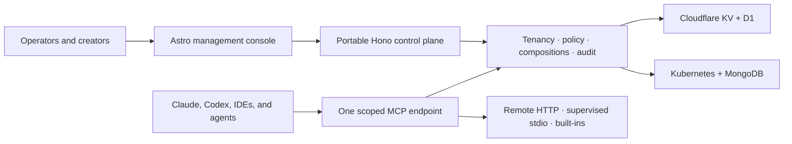

<p align="center">
  
</p>

# LiteMCP Composer

One governed MCP endpoint for every user and agent.

LiteMCP Composer is an Apache-2.0, MCP-native enterprise composition control
plane. It composes multiple MCP servers behind one stable endpoint while
preserving every capability's schema, identity, provenance, version, risk,
policy, route, and audit context. The same portable TypeScript packages compose
the managed cloud target—currently implemented with Cloudflare infrastructure—
and the portable Node target for Docker and Kubernetes. Neither target is
presented here as a production-proven release.

## MCP is the product

LiteMCP Composer is not an LLM proxy, agent framework, or generic integration
catalog with an MCP endpoint attached. Its product model starts with MCP-native
objects and journeys:

- versioned composition graphs, namespaces, aliases, collision handling, and
  stable downstream endpoints;
- protocol-faithful capability schemas, discovery, invocation, cancellation,
  errors, and compatibility evidence;
- identity-scoped sessions with the same authorization decision at
  `tools/list` and `tools/call`;
- approval, routing, health, provenance, and audit tied to the exact upstream
  capability and request;
- portable configuration and behavior across managed cloud, Docker, and
  Kubernetes.

The current code proves a focused subset of that model. The implementation
status names every remaining gap instead of presenting the target architecture
as shipped behavior.

> **Pre-1.0:** the repository contains a working vertical slice, not a claim of
> complete enterprise readiness. Read [`IMPLEMENTATION_STATUS.md`](./IMPLEMENTATION_STATUS.md)
> and [`docs/known-limitations.md`](./docs/known-limitations.md) before a
> production deployment.

## What works today

- Astro 7 public site, Better Auth login, and a dense React management console.
- Hono control-plane API with versioned schemas, OpenAPI, RFC 9457-style errors,
  request IDs, tenant authorization, and real create/simulate/session actions.
- One MCP Streamable HTTP endpoint composing a built-in calculator and remote
  finance server, including tool aliases and provenance.
- The same deterministic policy evaluation at `tools/list` and `tools/call`;
  hidden tools stay denied when invoked directly.
- Short-lived, tenant-scoped MCP session credentials stored only as hashes.
- Metadata-only, redacted, hash-chained audit records and approval-request
  creation bound to an argument hash.
- Portable `DocumentStore` with in-memory, Cloudflare KV, and MongoDB adapters.
- Better Auth wiring for password sessions, organization membership, MFA
  primitives, bearer/JWT/API-key auth, OIDC/SAML SSO, and SCIM provider
  configuration; live enterprise-provider journeys remain unproven.
- A managed cloud dry-run bundle built on Cloudflare Workers, KV, D1, and static
  Astro assets; portable Node/Mongo images, Docker Compose configuration, and a
  production-oriented Helm target that lints and renders but has not yet passed
  a live cluster run.
- TypeScript SDK, dependency-free Python SDK, operational CLI, and a runnable
  two-upstream example.

## Architecture



Cloudflare dependencies stop at the composition root and adapter boundary.
Product records use a NoSQL `DocumentStore`; Better Auth persistence is a
separate concern. Cloudflare KV explicitly reports eventual consistency,
whereas the MongoDB adapter supports revision-safe writes and transactions.
See [`ARCHITECTURE.md`](./ARCHITECTURE.md) for trust boundaries and deployment
decisions.

## Local demo

Requirements: Node.js 22.12+, Corepack, and pnpm 10.30.2.

```bash
corepack enable
pnpm install --frozen-lockfile
LITEMCP_DEMO_MODE=true pnpm dev
```

Open [http://localhost:4321](http://localhost:4321), then choose **Open console**.
The demo is visibly labeled and sends fixed `org_demo` authorization headers;
it is disabled by default in production configurations.

In another terminal, prove that two different upstream transports are exposed
through one scoped endpoint:

```bash
pnpm --filter @litemcp/example-local-composition dev
```

The example creates a ten-minute employee session, negotiates MCP, lists the
policy-filtered catalog, calls the `sum` alias, and calls
`finance.list_invoices`. A direct attempt to call the hidden refund tool is
denied and audited by the gateway tests.

Useful API surfaces:

- `GET /health` and `GET /ready`
- `GET /api/v1/openapi.json`
- `GET /api/v1/overview`
- `POST /api/v1/policy/simulate`
- `POST /api/v1/sessions`
- `POST /mcp/:tenantId/:compositionSlug`

## Deployment

### Managed cloud

The managed cloud app currently uses Cloudflare Workers to serve the static
Astro site and API on one origin. Product records use Workers KV, and Better
Auth uses D1. Those provider details remain confined to this composition root
and `packages/adapter-cloudflare`.

```bash
pnpm --filter @litemcp/managed-cloud db:migrate:local
pnpm managed-cloud:dev
```

For a fresh account, authenticate Wrangler and upload an inactive Worker
version first. The version upload provisions the draft KV and D1 bindings
without directing production traffic to an unmigrated database:

```bash
pnpm --filter @litemcp/managed-cloud exec wrangler login
pnpm --filter @litemcp/managed-cloud exec wrangler whoami
pnpm --filter @litemcp/web build
pnpm --filter @litemcp/managed-cloud exec wrangler versions upload
pnpm --filter @litemcp/managed-cloud exec wrangler versions secret put BETTER_AUTH_SECRET
pnpm --filter @litemcp/managed-cloud db:migrate:remote
```

Before deploying traffic, configure an account-owned route or custom domain
and make `PUBLIC_ORIGIN` and `WEB_ORIGINS` in `wrangler.jsonc` match its exact
HTTPS origin. Do not deploy the default `workers.dev` URL while those variables
name `litemcpcomposer.com`. Then deploy and smoke-test the site, auth, API, and
a scoped MCP session:

```bash
pnpm managed-cloud:deploy
```

The upload/deploy commands are external mutations, not validation commands. A
production rollout also needs the stronger serialized mutation boundary
described in the known limitations.

After one-time resource bootstrap, `.github/workflows/deploy-managed-cloud.yml`
can deploy green `main` checkpoints when the protected GitHub environment has
Cloudflare credentials, an exact HTTPS origin, and the explicit resource-ready
and auto-deploy variables. It remains disabled until those values are supplied.

### Docker Compose

```bash
cp deploy/docker-compose/.env.example deploy/docker-compose/.env
# Replace BETTER_AUTH_SECRET in the copied file.
pnpm docker:up
```

The console is at `http://localhost:8080`; it reverse-proxies API, auth, and MCP
traffic to the Node service. MongoDB runs as a local replica set. See
[`docs/on-prem/installation.md`](./docs/on-prem/installation.md).

### Kubernetes

```bash
pnpm helm:lint
pnpm helm:template
helm upgrade --install litemcp deploy/helm/litemcp \
  --namespace litemcp --create-namespace \
  --values deploy/helm/litemcp/examples/ha-values.yaml
```

The chart expects an external MongoDB replica set and an existing Kubernetes
Secret; it does not bundle credentials. It includes non-root/read-only security
contexts, probes, resource limits, HPA, disruption budgets, topology spreading,
Ingress, and NetworkPolicy. See the chart README and the air-gap, backup, and
upgrade runbooks under `docs/on-prem`.

## Repository guide

| Area | Purpose | Guide |
| --- | --- | --- |
| `apps` | Deployable website, managed cloud, and portable server | [`apps/README.md`](./apps/README.md) |
| `packages` | Portable product capabilities and infrastructure adapters | [`packages/README.md`](./packages/README.md) |
| `deploy` | Docker Compose, container images, and Kubernetes/Helm | [`deploy/README.md`](./deploy/README.md) |
| `examples` | Runnable SDK and MCP composition examples | [`examples/README.md`](./examples/README.md) |
| `docs` | Product, security, identity, policy, and operations guidance | [`docs/README.md`](./docs/README.md) |

## Workspace

```text
apps/web                 Astro public site, login, and console
apps/managed-cloud       Managed cloud deployment, currently on Cloudflare
apps/server              Portable Node/Mongo composition root
packages/contracts       Zod domain and API contracts
packages/core            Platform service, policy, security, audit
packages/mcp-gateway     MCP negotiation, discovery, execution adapters
packages/auth            Better Auth, SSO, SCIM, MFA/API-key primitives
packages/storage         Portable NoSQL contract and memory adapter
packages/adapter-*       Cloudflare KV and MongoDB implementations
packages/sdk-typescript  Typed control-plane and MCP clients
packages/sdk-python      Standard-library Python client
packages/cli             Operational CLI
deploy                   Docker Compose, images, and Helm chart
```

## Quality gates

```bash
pnpm check
pnpm helm:lint
pnpm helm:template
```

CI installs with a frozen lockfile, checks formatting and types, runs unit and
integration tests, builds every package, validates the managed cloud Wrangler
dry-run bundle, and renders Docker Compose and Helm configuration. A separate
workflow publishes validated edge images to GHCR after CI; the implementation
status records whether that remote workflow has actually passed. Kubernetes
runtime smoke coverage is intentionally not overstated.

## Product and security documentation

- [`docs/product-requirements.md`](./docs/product-requirements.md)
- [`docs/feature-reference.md`](./docs/feature-reference.md)
- [`docs/requirements-traceability.md`](./docs/requirements-traceability.md)
- [`docs/mcp-native-positioning.md`](./docs/mcp-native-positioning.md)
- [`docs/mcp-composition-lifecycle.md`](./docs/mcp-composition-lifecycle.md)
- [`docs/console-guide.md`](./docs/console-guide.md)
- [`docs/api-and-sdk-reference.md`](./docs/api-and-sdk-reference.md)
- [`docs/configuration-reference.md`](./docs/configuration-reference.md)
- [`docs/operations/runbook.md`](./docs/operations/runbook.md)
- [`docs/connector-authoring.md`](./docs/connector-authoring.md)
- [`docs/troubleshooting.md`](./docs/troubleshooting.md)
- [`docs/composio-capability-parity.md`](./docs/composio-capability-parity.md)
- [`docs/policy/routing-and-authorization.md`](./docs/policy/routing-and-authorization.md)
- [`docs/security/threat-model.md`](./docs/security/threat-model.md)
- [`docs/security/credential-handling.md`](./docs/security/credential-handling.md)
- [`docs/identity/entra-id.md`](./docs/identity/entra-id.md)
- [`docs/identity/scim.md`](./docs/identity/scim.md)
- [`docs/release-and-lts-policy.md`](./docs/release-and-lts-policy.md)
- [`docs/pattern-audit.md`](./docs/pattern-audit.md)
- [`docs/pattern-decisions.md`](./docs/pattern-decisions.md)

## Open source and commercial model

The current product and its full capability roadmap are Apache-2.0. The managed
cloud is intended to remain free under future published fair-use limits, and
self-hosting remains free. Commercial offerings may eventually provide
deployment, operations, migration, training, incident response, support, and
future LTS/SLA commitments—never a closed enterprise feature gate.

See [`CONTRIBUTING.md`](./CONTRIBUTING.md), [`SECURITY.md`](./SECURITY.md), and
[`GOVERNANCE.md`](./GOVERNANCE.md). The shorter `liteMCP` repository name has
existing uses; it is not a trademark-clearance claim. The product-facing name
throughout this project is **LiteMCP Composer**.
