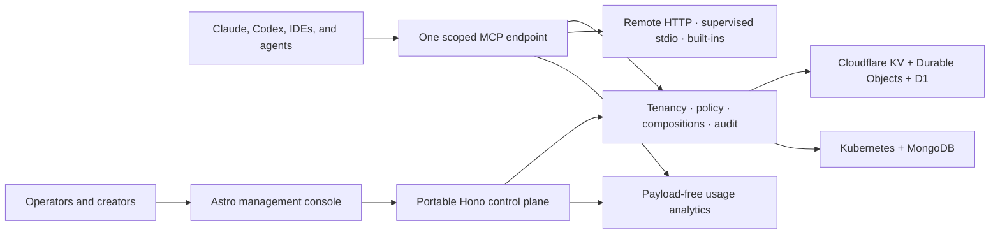

<p align="center">
  
</p>

# LiteMCP Composer

One governed MCP endpoint for every user and agent.

LiteMCP Composer is an Apache-2.0, MCP-native enterprise composition control
plane. It composes multiple MCP servers behind one stable endpoint while
preserving every capability's schema, identity, provenance, version, risk,
policy, route, and audit context. The same portable TypeScript packages compose
the portable Node target for Docker and Kubernetes and the public Cloudflare
reference composition. The public repository is the complete, independently
operable product boundary: it requires no proprietary sibling, vendor account,
license server, billing endpoint, or mandatory call-home. A separately
maintained proprietary sibling owns the operated hosted service, billing,
fleet/client operations, and commercial support entitlements. Neither public
deployment target is presented here as a production-proven release.

## MCP is the product

LiteMCP Composer is not an LLM proxy, agent framework, or generic integration
catalog with an MCP endpoint attached. Its product model starts with MCP-native
objects and journeys:

- versioned composition graphs, namespaces, aliases, collision handling, and
  stable downstream endpoints;
- protocol-faithful capability schemas, discovery, invocation, cancellation,
  errors, and compatibility evidence;
- identity-scoped sessions with the same authorization decision at
  `tools/list` and `tools/call`;
- approval, routing, health, provenance, and audit tied to the exact upstream
  capability and request;
- portable configuration and behavior across the Cloudflare reference,
  Docker, and Kubernetes targets.

The current code proves a focused subset of that model. The implementation
status names every remaining gap instead of presenting the target architecture
as shipped behavior.

> **Pre-1.0:** the repository contains a working vertical slice, not a claim of
> complete enterprise readiness. Read [`IMPLEMENTATION_STATUS.md`](./IMPLEMENTATION_STATUS.md)
> and [`docs/known-limitations.md`](./docs/known-limitations.md) before a
> production deployment.

## What works today

- Astro 7 public site, Better Auth login, and a dense React management console.
- Hono control-plane API with versioned schemas, OpenAPI, RFC 9457-style errors,
  request IDs, tenant authorization, and management lifecycle actions.
- One MCP Streamable HTTP endpoint composing a built-in calculator and remote
  finance server, including tool aliases and provenance.
- The same deterministic policy evaluation at `tools/list` and `tools/call`;
  hidden tools stay denied when invoked directly.
- Short-lived, tenant-scoped MCP session credentials stored only as hashes.
- Metadata-only, redacted, hash-chained audit records and one-shot approvals
  bound to the complete session/composition/server/policy context and argument
  hash.
- A separate fail-open Insight Plane with strict payload-free usage events,
  client/session attribution, total and upstream latency, tenant-gated JSON/CSV
  APIs, exact quota standing, Mongo time-series and Cloudflare analytics
  adapters, and a six-view console. The current revision has local evidence
  only; client names are self-reported and Cloudflare historical queries are
  limited to a capped exact feed.
- MCP OAuth metadata, bounded public-client registration, explicit consent,
  PKCE, 15-minute access tokens, optional rotating refresh, and revocation,
  covered locally but not verified with a named client.
- Portable `DocumentStore` with in-memory and MongoDB adapters plus a
  Cloudflare reference hybrid of KV and a per-tenant SQLite Durable Object.
- Better Auth wiring for password sessions, organization membership, MFA
  primitives, bearer/JWT/API-key auth, OIDC/SAML SSO, and SCIM provider
  configuration; live enterprise-provider journeys remain unproven.
- A Cloudflare reference dry-run bundle built on Workers, KV, D1, and static
  Astro assets; portable Node/Mongo images, Docker Compose configuration, and a
  production-oriented Helm target that lints and renders but has not yet passed
  a live cluster run.
- TypeScript SDK, dependency-free Python SDK, operational CLI, and a runnable
  two-upstream example.

## Architecture



Cloudflare dependencies stop at the composition root and adapter boundary.
Product records use a NoSQL `DocumentStore`; Better Auth persistence is a
separate concern. Cloudflare KV explicitly reports eventual consistency,
whereas the MongoDB adapter supports revision-safe writes and transactions.
See [`ARCHITECTURE.md`](./ARCHITECTURE.md) for trust boundaries and deployment
decisions.

## Local demo

Requirements: Node.js 22.12+, Corepack, and pnpm 10.30.2.

```bash
corepack enable
pnpm install --frozen-lockfile
LITEMCP_DEMO_MODE=true pnpm dev
```

Open [http://localhost:4321](http://localhost:4321), then choose **Open console**.
The demo is visibly labeled and sends fixed `org_demo` authorization headers;
it is disabled by default in production configurations, where the demo toggle
is not rendered.

To prove the governed endpoint without keeping two terminals open, run:

```bash
pnpm demo:smoke
```

This starts a real loopback Node server, asserts filtered discovery, builtin and
remote execution, hidden denial, approval pause/resume, redacted audit evidence,
activation semantics, and revocation, then always cleans up the server.

Agent configuration is generated from the reviewed `.harness` source for both
Codex (`.agents`) and Claude (`.claude`). On a fresh checkout, or after pulling
a change that touches `.harness`, regenerate the ignored live surfaces:

```bash
pnpm setup:harness
```

For changes to agent instructions, skills, or profiles, edit `.harness`, run
`pnpm harness:validate`, preview with `pnpm harness:preview`, then apply only
after reviewing the plan with `pnpm harness:activate`. A second preview must
converge to stable `keep` actions. Select a temporary focus without changing the
skill catalog:

```bash
pnpm harness:profile:list
pnpm harness:profile security
pnpm harness:preview
pnpm harness:activate
pnpm harness:preview
pnpm harness:profile:clear
pnpm harness:preview
pnpm harness:activate
pnpm harness:preview
```

The available profiles focus agents on security, deployment, release,
observability, identity, MCP compatibility, open-core boundaries, or fast
vertical-slice iteration. The selector `.harnessProfile` is local and
intentionally not committed.

The same proof can be run manually against the interactive server:

```bash
pnpm --filter @litemcp/example-local-composition dev
```

The example creates scoped employee and finance sessions, negotiates MCP, lists
the policy-filtered catalog, calls both transports, denies a hidden tool, pauses
and resumes an approval-gated action, checks redacted audit evidence, and proves
session revocation. This is repository wire evidence, not named-client
certification.

Useful API surfaces:

- `GET /health` and `GET /ready`
- `GET /api/v1/openapi.json`
- `GET /api/v1/overview`
- `GET /api/v1/analytics/summary`
- `GET /api/v1/usage`
- `POST /api/v1/policy/simulate`
- `POST /api/v1/sessions`
- `POST /mcp/:tenantId/:compositionSlug`

See [`docs/usage-observability.md`](./docs/usage-observability.md) for the
analytics/audit boundary, storage limits, query semantics, and unproved
acceptance work.

## Deployment

### Cloudflare reference composition

The public preview is live at
[`litemcpcomposer.com`](https://litemcpcomposer.com). It currently uses
Cloudflare Workers to serve the static Astro site and API on one origin. The
current working tree keeps non-authoritative records in Workers KV, routes the
security-sensitive product slice through a per-tenant SQLite Durable Object,
and stores Better Auth data in D1. Those working-tree authority changes are not
deployed to the recorded public preview. Provider details remain confined to
this composition root and `packages/adapter-cloudflare`. The source here is an
Apache-licensed historical/reference composition, not the proprietary
sibling's operated-service configuration. These commands deploy into an
operator-owned Cloudflare account and do not grant hosted-service support.

```bash
pnpm --filter @litemcp/managed-cloud db:migrate:local
pnpm managed-cloud:dev
```

For a fresh account, create the account-owned KV and D1 resources explicitly,
check in their reviewed IDs, and apply the Durable Object lifecycle with
`wrangler deploy` from the exact verified CI payload. Cloudflare does not allow
a first deployment or a pending Durable Object lifecycle migration through
`wrangler versions upload`. The lifecycle operation requires secure first-deploy
secrets and a full maintenance/write-freeze boundary; follow the dedicated
[Durable Object lifecycle runbook](./docs/operations/cloudflare-durable-object-lifecycle.md).
After that runbook's remote check passes, configure the runtime secrets and D1
schema for the explicit target:

```bash
pnpm --filter @litemcp/managed-cloud exec wrangler login
pnpm --filter @litemcp/managed-cloud exec wrangler whoami
pnpm managed-cloud:do-lifecycle -- --env production
pnpm --filter @litemcp/managed-cloud exec wrangler versions secret put BETTER_AUTH_SECRET --env=
pnpm --filter @litemcp/managed-cloud db:migrate:remote
```

Before deploying traffic, configure an account-owned route or custom domain
and make `PUBLIC_ORIGIN` and `WEB_ORIGINS` in `wrangler.jsonc` match its exact
HTTPS origin. Do not deploy the default `workers.dev` URL while those variables
name `litemcpcomposer.com`. Then deploy and smoke-test the site, auth, API, and
a scoped MCP session:

```bash
pnpm --filter @litemcp/managed-cloud exec wrangler triggers deploy --env=
# Then dispatch deploy-managed-cloud-staging.yml and promote its accepted SHA
# with deploy-managed-cloud.yml.
```

Worker version promotion intentionally does not manage routes/custom domains;
apply trigger changes as their own reviewed mutation and verify DNS/TLS plus the
exact origin before setting a resource-ready marker. The marker also attests
that the separately applied lifecycle operation reached the final checked-in
migration tag; every promotion verifies that state remotely before upload.

The upload/deploy commands are external mutations, not validation commands. A
production rollout must apply and accept the current Durable Object/D1
migrations; per-document serialization does not remove the multi-document and
external-dispatch limits described in the known limitations.

After the one-time lifecycle/resource bootstrap,
`.github/workflows/deploy-managed-cloud-staging.yml` can deploy an exact
main-branch SHA only after the matching CI run succeeds. Staging requires both
public health/readiness and an authenticated read-only MCP smoke, then retains
non-secret acceptance evidence. Production promotion is an explicit dispatch
of `.github/workflows/deploy-managed-cloud.yml` with that exact SHA and staging
run ID; it verifies the evidence before entering the production environment
declared by the workflow. Both workflows remain disabled until the
customer-owned reference deployment variables, resource IDs, credentials,
origins, and smoke tuple are configured. GitHub environment reviewers,
deployment-branch policies, and the `Required checks` branch rule are
repository-admin controls: this repository validates the workflow contract,
but the current upstream repository has not configured those remote protections.

### Docker Compose

```bash
cp deploy/docker-compose/.env.example deploy/docker-compose/.env
# Replace every placeholder secret, including the MongoDB password/keyfile.
pnpm docker:up
```

The console is at `http://localhost:8080`; it reverse-proxies API, auth, and MCP
traffic to the Node service. MongoDB runs as an authenticated single-member
replica set for local evaluation. See
[`docs/on-prem/installation.md`](./docs/on-prem/installation.md).

### Kubernetes

```bash
pnpm helm:lint
pnpm helm:template
helm upgrade --install litemcp deploy/helm/litemcp \
  --namespace litemcp --create-namespace \
  --values deploy/helm/litemcp/examples/ha-values.yaml
```

The chart expects an external MongoDB replica set and an existing Kubernetes
Secret; it does not bundle credentials. It includes non-root/read-only security
contexts, probes, resource limits, HPA, disruption budgets, topology spreading,
Ingress, and NetworkPolicy. See the chart README and the air-gap, backup, and
upgrade runbooks under `docs/on-prem`.

## Repository guide

| Area | Purpose | Guide |
| --- | --- | --- |
| `apps` | Deployable website, Cloudflare reference, and portable server | [`apps/README.md`](./apps/README.md) |
| `packages` | Portable product capabilities and infrastructure adapters | [`packages/README.md`](./packages/README.md) |
| `deploy` | Docker Compose, container images, and Kubernetes/Helm | [`deploy/README.md`](./deploy/README.md) |
| `examples` | Runnable SDK and MCP composition examples | [`examples/README.md`](./examples/README.md) |
| `docs` | Product, security, identity, policy, and operations guidance | [`docs/README.md`](./docs/README.md) |

## Workspace

```text
apps/web                 Astro public site, login, and console
apps/managed-cloud       Historical Apache Cloudflare reference composition
apps/server              Portable Node/Mongo composition root
packages/contracts       Zod domain and API contracts
packages/core            Platform service, policy, security, audit
packages/mcp-gateway     MCP negotiation, discovery, execution adapters
packages/auth            Better Auth, SSO, SCIM, MFA/API-key primitives
packages/storage         Portable NoSQL contract and memory adapter
packages/adapter-*       Cloudflare KV and MongoDB implementations
packages/sdk-typescript  Typed control-plane and MCP clients
packages/sdk-python      Standard-library Python client
packages/cli             Operational CLI
deploy                   Docker Compose, images, and Helm chart
```

## Quality gates

```bash
pnpm check
pnpm python:test
pnpm harness:ci
pnpm security:audit
pnpm security:audit:all
pnpm ci:policy
pnpm managed-cloud:auth-schema:check
pnpm auth:migrate:mongodb:self-test
pnpm helm:lint
pnpm helm:template
```

CI installs with a frozen lockfile, checks formatting/types, runs TypeScript and
Python SDK tests, builds every package, applies and converges Harness config in
the disposable checkout, enforces production dependency and workflow policy
gates, proves Better Auth's generated D1 schema and guarded MongoDB upgrade
planner, validates local D1 migrations plus Cloudflare dry runs, scans secrets,
dependencies, and exact container digests, and renders Docker Compose and Helm configuration. A single
required-check aggregator prevents an optional/skipped job from masking a
failed mandatory gate. The full dependency graph allows only reviewed,
path-bound, expiring exceptions in
`.github/dependency-audit-allowlist.json`; production dependencies have no such
exception. Canonical-repository main CI pushes run-and-attempt-qualified
candidate images with SBOM and provenance, scans their exact digests, and
retains run-bound evidence; forks still build and scan both images locally
without attempting to write the upstream registry. A serialized publisher then
promotes those digests without rebuilding, refuses to supersede a newer
successful main run when qualification or the immediate pre-`edge` freshness
check observes one, refuses to change an existing `sha-<commit>` alias to
another digest, and verifies that alias plus `edge` after each registry write.
GHCR cannot atomically update the server and web repositories, so a partial
`edge` update and the residual API-read/registry-write race remain visible,
rerunnable operational boundaries. The
implementation status records whether this new remote workflow has actually
passed. Kubernetes runtime smoke coverage is intentionally not overstated.

## Product and security documentation

- [`OPEN_CORE.md`](./OPEN_CORE.md)
- [`docs/adr/0001-open-product-core-hosted-control-plane.md`](./docs/adr/0001-open-product-core-hosted-control-plane.md)
- [`docs/product-requirements.md`](./docs/product-requirements.md)
- [`docs/feature-reference.md`](./docs/feature-reference.md)
- [`docs/requirements-traceability.md`](./docs/requirements-traceability.md)
- [`docs/mcp-native-positioning.md`](./docs/mcp-native-positioning.md)
- [`docs/mcp-composition-lifecycle.md`](./docs/mcp-composition-lifecycle.md)
- [`docs/console-guide.md`](./docs/console-guide.md)
- [`docs/api-and-sdk-reference.md`](./docs/api-and-sdk-reference.md)
- [`docs/mcp-client-compatibility.md`](./docs/mcp-client-compatibility.md)
- [`docs/managed-cloud-fair-use.md`](./docs/managed-cloud-fair-use.md)
- [`docs/configuration-reference.md`](./docs/configuration-reference.md)
- [`docs/operations/runbook.md`](./docs/operations/runbook.md)
- [`docs/connector-authoring.md`](./docs/connector-authoring.md)
- [`docs/troubleshooting.md`](./docs/troubleshooting.md)
- [`docs/composio-capability-parity.md`](./docs/composio-capability-parity.md)
- [`docs/policy/routing-and-authorization.md`](./docs/policy/routing-and-authorization.md)
- [`docs/security/threat-model.md`](./docs/security/threat-model.md)
- [`docs/security/credential-handling.md`](./docs/security/credential-handling.md)
- [`docs/identity/entra-id.md`](./docs/identity/entra-id.md)
- [`docs/identity/scim.md`](./docs/identity/scim.md)
- [`docs/release-and-lts-policy.md`](./docs/release-and-lts-policy.md)
- [`docs/pattern-audit.md`](./docs/pattern-audit.md)
- [`docs/pattern-decisions.md`](./docs/pattern-decisions.md)

## Open product and hosted-service model

The public Apache-2.0 repository is the complete, independently operable
product boundary. "Complete" describes that self-hosting does not depend on
private code, a service account, license or billing endpoints, or mandatory
call-home; it does not overstate the pre-1.0 implementation status. A separately
maintained proprietary sibling owns the operated service, billing and metering,
fleet and managed-client operations, commercial support grants and
entitlements, and SLA/on-call/compliance work. It may depend on the public
product; the public product must not depend on it.

All source already published here—including `apps/managed-cloud`—keeps its
Apache-2.0 grant. Later movement, replacement, or removal cannot revoke the
license for historical revisions. See [`OPEN_CORE.md`](./OPEN_CORE.md) for the
boundary and its governing ADR.

See [`CONTRIBUTING.md`](./CONTRIBUTING.md), [`SECURITY.md`](./SECURITY.md), and
[`GOVERNANCE.md`](./GOVERNANCE.md). The shorter `liteMCP` repository name has
existing uses; it is not a trademark-clearance claim. The product-facing name
throughout this project is **LiteMCP Composer**.
